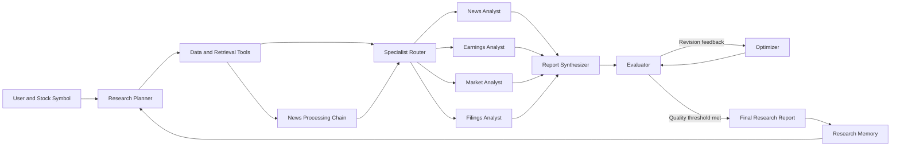

<!-- fullWidth: false tocVisible: false tableWrap: true -->
# Multi-Agent Financial Analysis System

An agentic AI investment research system that coordinates specialized agents\
to analyze market data, financial news, earnings, and company filings. The\
project demonstrates research planning, dynamic tool use, self-reflection,\
cross-run memory, prompt chaining, intelligent routing, and iterative analysis\
refinement.

> **Course:** AAI-520 — Natural Language Processing and Generative AI
>
> **Project:** Final Team Project — Multi-Agent Financial Analysis System

## Table of Contents

- [Project Overview](#project-overview)
- [Objectives](#objectives)
- [System Architecture](#system-architecture)
- [Agent Functions and Capabilities](#agent-functions-and-capabilities)
- [Required Workflow Patterns](#required-workflow-patterns)
- [Data Sources and Tools](#data-sources-and-tools)
- [Repository Structure](#repository-structure)
- [Getting Started](#getting-started)
- [Usage](#usage)
- [Evaluation and Iteration](#evaluation-and-iteration)
- [Memory and Learning Across Runs](#memory-and-learning-across-runs)
- [Project Deliverables](#project-deliverables)
- [Team and Contributions](#team-and-contributions)
- [Limitations and Responsible Use](#limitations-and-responsible-use)

## Project Overview

This project builds an autonomous Investment Research Agent that accepts a\
stock symbol, plans a research strategy, gathers relevant financial\
information, routes that information to specialist agents, and produces a\
quality-controlled investment research report. The system is designed to make\
its reasoning process and workflow decisions observable in the final project\
notebook.

The system focuses on research support rather than automated trading or\
personalized investment advice.

## Objectives

The project has four primary objectives:

1. Plan an appropriate sequence of research tasks for a supplied stock symbol.
2. Select and use financial APIs, datasets, and retrieval tools dynamically.
3. Evaluate the completeness, factual grounding, and clarity of generated\
   analysis, then improve it using structured feedback.
4. Preserve brief notes from prior runs so future analyses can avoid repeated\
   issues and build on useful findings.

## System Architecture

The planned workflow coordinates a research agent with several specialized\
agents and data tools.



## Agent Functions and Capabilities

### Research Planner

- Interprets the requested stock symbol and research goal.
- Creates a task plan based on available tools and required evidence.
- Adjusts the plan when data is missing, stale, or unavailable.

### Tool-Using Research Agent

- Retrieves price history, company fundamentals, financial news, economic\
  indicators, and regulatory filings as needed.
- Records source metadata and retrieval times for traceability.
- Handles API errors, rate limits, and missing records gracefully.

### Specialist Agents

- **News Analyst:** identifies sentiment, catalysts, risks, and material events.
- **Earnings Analyst:** examines revenue, profitability, guidance, and earnings\
  trends.
- **Market Analyst:** evaluates price behavior, volatility, volume, and market\
  context.
- **Filings Analyst:** extracts relevant facts and risk disclosures from company\
  filings.

### Report Synthesizer

- Combines specialist findings into a consistent research report.
- Separates sourced facts from interpretations.
- Highlights supporting and conflicting signals, risks, and data gaps.

### Evaluator and Optimizer

- Scores the draft against a defined quality rubric.
- Produces actionable feedback for weak or missing areas.
- Revises the report until it satisfies a quality threshold or reaches a\
  configured iteration limit.

### Memory Component

- Stores concise lessons, recurring data-quality issues, and prior research\
  notes.
- Retrieves only relevant memories for subsequent runs.
- Avoids treating outdated memories as current market evidence.

## Required Workflow Patterns

### 1\. Prompt Chaining

Financial news is processed through a sequence of focused stages:

```text
Ingest News -> Preprocess -> Classify -> Extract -> Summarize
```

Each stage produces a structured output for the next stage, making the process\
easier to inspect, test, and improve.

### 2\. Routing

The router examines the content type and sends it to the appropriate specialist.\
For example, an earnings release is routed to the Earnings Analyst, a material\
SEC filing to the Filings Analyst, and market-price data to the Market Analyst.\
Content may be sent to more than one specialist when multiple perspectives are\
needed.

### 3\. Evaluator–Optimizer

The system generates a draft report, evaluates it against explicit criteria,\
and uses the resulting feedback to refine the analysis. The loop stops when the\
report meets the quality threshold or the maximum number of iterations is\
reached.

## Data Sources and Tools

The implementation may use the following sources, subject to availability and\
API access:

| Source                             | Intended use                                          |
| ---------------------------------- | ----------------------------------------------------- |
| Yahoo Finance / `yfinance`         | Prices, company information, and financial statements |
| SEC EDGAR                          | Company filings and regulatory disclosures            |
| FRED                               | Macroeconomic indicators                              |
| NewsAPI or financial-news datasets | Current and historical company news                   |
| Alpha Vantage                      | Supplemental market and fundamental data              |

All external information used in a report should retain its source and retrieval\
date. API credentials must be stored in environment variables and must not be\
committed to the repository.

## Repository Structure

The repository is expected to follow a structure similar to the following as\
the implementation is developed:

```text
.
├── README.md
├── requirements.txt
├── .env.example
├── notebooks/
│   └── investment_research_agent.ipynb
├── src/
│   ├── agents/
│   ├── workflows/
│   ├── tools/
│   ├── memory/
│   └── evaluation/
├── tests/
├── data/
│   └── README.md
└── outputs/
```

Generated data, reports, notebook checkpoints, secrets, and other large or\
sensitive files should be excluded through `.gitignore` where appropriate.

## Getting Started

### Prerequisites

- Python 3.10 or later
- Git
- Jupyter Notebook or JupyterLab
- API keys for any selected credentialed data sources

### Installation

```bash
git clone <repository-url>
cd multi-agent-financial-analysis
python -m venv .venv
source .venv/bin/activate
python -m pip install -r requirements.txt
```

On Windows PowerShell, activate the environment with:

```powershell
.venv\Scripts\Activate.ps1
```

### Configuration

When `.env.example` is available, copy it to `.env` and add the required API\
credentials:

```bash
cp .env.example .env
```

Never commit the populated `.env` file or expose API keys in notebook output.

## Usage

The primary demonstration will be provided in the project notebook. After the\
dependencies and credentials are configured, start Jupyter and run the notebook\
from top to bottom:

```bash
jupyter lab
```

The notebook will accept a stock symbol, execute the three required workflows,\
display intermediate agent outputs, and generate an evaluated final report.\
Concrete commands and examples will be added as the implementation is completed.

## Evaluation and Iteration

Draft reports will be evaluated with measurable criteria such as:

- factual support and source traceability;
- coverage of market, earnings, news, and filing evidence;
- distinction between evidence and interpretation;
- identification of risks, contradictions, and missing data;
- clarity, organization, and usefulness of the final report; and
- successful completion of the required workflows.

The notebook will retain initial drafts, evaluator scores, feedback, and revised\
outputs to demonstrate the evaluator–optimizer cycle. Tests will cover core\
workflow behavior and failure cases where practical.

## Memory and Learning Across Runs

The system will store short, inspectable research memories rather than silently\
changing model behavior. Each memory should include a timestamp and enough\
context to determine whether it remains relevant. Current API data takes\
precedence over prior-run notes whenever the two conflict.

## Project Deliverables

The final submission will include:

- a working, fully executed code notebook;
- visible demonstrations of the four autonomous agent functions;
- visible demonstrations of prompt chaining, routing, and the\
  evaluator–optimizer workflow;
- evaluation evidence and at least one feedback-driven revision;
- comments explaining the agent design, capabilities, evaluation, and\
  iteration process;
- a link to this GitHub repository in the notebook; and
- an exported PDF (preferred) or HTML version of the notebook for submission.

## Team and Contributions

| Team member     | Primary responsibilities |
| --------------- | ------------------------ |
| Brandon Wirgau  |                          |
| Arslan Isaac    |                          |
| *Christina Sadiq* |                          |

Team members will use issues, branches, pull requests, commits, and code reviews\
to coordinate work and document individual contributions.

## Limitations and Responsible Use

This project is an educational research prototype. Its outputs may be\
incomplete, delayed, or incorrect and should not be interpreted as personalized\
financial advice or as a recommendation to buy, sell, or hold a security. Users\
should verify important claims against primary sources and consult a qualified\
financial professional before making investment decisions.